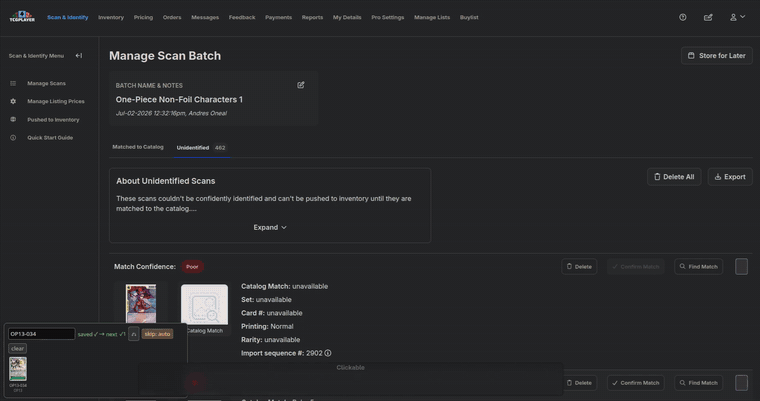

# TCGplayer Quick Match

A userscript that turns the **TCGplayer Seller Portal → Scan & Identify** page into a fast, keyboard-driven catalog-matching workflow. Built for high-volume sellers matching stacks of unidentified card scans (One Piece & Pokémon), where the stock UI means a lot of typing, hovering, and mouse travel per card.

> **Not affiliated with TCGplayer.** This is a personal productivity aid that stays *human-in-the-loop* — it opens the search, pre-selects the exact-number match, and shows you an enlarged comparison, but **you** verify and press the key to save. It does not scrape, bulk-submit, or act without you.

---

## Demo

**Matching unidentified scans** — type a number, Enter to open and auto-select, glance at the scan-vs-catalog comparison, Enter to save.



**Review mode** — auditing what the scanner already matched: both images enlarged, Enter to approve, X to re-match. Corrections it has seen before get flagged and applied in one keypress.


---

## Why

Matching an unidentified scan on the stock page means: read the card number off a tiny thumbnail, click **Find Match**, type the number, wait for results, hover each result to read its set/rarity, click **Select**, hover both images to eyeball them, then **Save**. Times a few hundred cards, that's death by a thousand micro-actions — and easy to misfile a valuable parallel as its common reprint.

Quick Match collapses that to a rhythm: **type → Enter → glance → Enter.**

## Features

- **One-key match flow** — type a card number, press **Enter**: it opens the modal, searches, and auto-selects the *exact* number match. Same card five times? Just tap Enter through them.
- **One Piece & Pokémon aware** — understands both `OP13-060` / `ST01-001` / `EB03-021` / `P-001` and Pokémon's `10/159`, including the nasty `EB03-021`-vs-`EB-03` (card # vs set code) ambiguity.
- **Base-vs-reprint guard** — the same number often exists as a base card *and* an event/anniversary/alt-art reprint (e.g. `OP13` vs `OP13 ANN`, `OP11` vs `OP11 RE`) with identical art and rarity. The script prefers the base set automatically, and when printings are genuinely ambiguous it **refuses to auto-save** and makes you choose.
- **Auto scan-vs-catalog verifier** — on every selection it pops an enlarged side-by-side of your scan and the catalog art, with the picked card's **name / set / number / rarity** underneath (set line highlighted, since that's what separates base from event prints). Glance, confirm, save — no hovering.
- **Recents tray + big picker** — every saved match goes into a tray. Press **Esc** for a full-screen picker: your scan on the left, the whole tray as a searchable gallery on the right. Arrow to it (or type a number that isn't saved) and Enter runs it.
- **Dynamic phantom-row skipping** — the portal sometimes leaves already-matched "phantom" rows stuck at the top of the unidentified list. `skip: auto` detects them (by each row's `Confirm Match` state) and targets the first genuinely-unmatched row instead — however many phantoms there are. Manual `skip: 1–4` override included.
- **Repair mode for mislabeled rows** — the scanner loves to file base cards under *"3rd Anniversary Tournament Cards"* (`OP13 ANN`). Flip `fix` on and the panel counts every mislabeled row on the page; **Enter** walks them one at a time — reading each row's own card number, opening `Find New Match`, and re-matching it to the base set. The reprint and any pre-release printing are excluded from the results outright, so they can't be picked by accident.
- **Review mode for the Matched to Catalog tab** (**Alt+A**) — the scanner's match is usually *plausible* and sometimes wrong: same art, different set, different number. Review mode walks the matched rows one at a time with **both images blown up side by side and a synced magnifier** — moving the cursor over either card zooms *both* to the same relative spot, so you read the two card numbers against each other instead of squinting at thumbnails. The catalog's claimed name / number / set / variant / confidence / listing price sits beside them. **Enter** (or ↓/→) = numbers agree, next card. **X** = wrong, re-match it.
- **Learned re-match patterns** — the scanner repeats its mistakes: the same bogus match comes back a dozen times in a 500-card batch. Every correction you make in review mode is banked *keyed on the wrong match* — the second time that same wrong match appears, review mode flags it in red (*"you corrected this 3× before → 54/64 Jungle"*) and **X** re-matches it in one keypress: no typing, no picking, straight to the verify overlay.
- **Learns as you go** — remembers the name/set you picked for a given number and uses it to disambiguate next time.
- **Undo / delete** on tray entries, session match counter, and per-row ⚡ / 🔧 buttons for out-of-order matching and repair.

## Install

1. Install a userscript manager — [Violentmonkey](https://violentmonkey.github.io/) or [Tampermonkey](https://www.tampermonkey.net/).
2. Install the script: **[tcgplayer-quick-match.user.js](https://raw.githubusercontent.com/JesusEgonVenegas/tcgplayer-quick-match/main/tcgplayer-quick-match.user.js)** (your manager will prompt to install; it auto-updates from this URL).
3. Open `https://sellerportal.tcgplayer.com/scan-identify/...` — a control panel appears bottom-left.

## Usage

A small panel docks to the bottom-left of the page. Type into its box and:

| Key / action | What it does |
|---|---|
| **Enter** (box) | No modal → open Find Match on the target row and search the typed number (auto-selects the exact match). Modal open + Save ready → **Save**. |
| **Esc** (box, no modal) | Open the full-screen **match picker** (scan left, tray gallery right). |
| Picker: **type** | Filter the tray — or type a number that isn't in the tray to search it directly. |
| Picker: **← ↑ ↓ →** / **Enter** / **Esc** | Move / pick & search / close. |
| **Esc** (verify shown) / **×** | Dismiss the enlarged comparison. |
| **skip** button | Cycle `auto → off → 1 → 2 → 3 → 4` (right-click steps back) to control which row is targeted. |
| **fix** button | Toggle repair mode; the label shows how many mislabeled rows are left on the page. |
| **Enter** (fix mode on) | Re-match the next mislabeled row to the base set of its own card number. Glance at the verify overlay, Enter again to save. |
| ⚡ (per row) | Match that specific row with the current box value. |
| 🔧 (per matched row) | Re-match that specific row to the base set of its own card number. |
| **Alt+A** / **review** button | Open **review mode** on the *Matched to Catalog* tab. |

### Review mode (auditing what the scanner matched)

On the **Matched to Catalog** tab, press **Alt+A**. One card fills the screen at a time: your scan and the catalog art, enlarged, with the catalog's claimed number, set, variant, confidence and listing price beside them.

| Key | What it does |
|---|---|
| **Enter** / **→** / **↓** | The numbers agree — approve and move to the next row. (Approving changes nothing on the page; it just advances.) |
| **X** / **Backspace** | Wrong match. Opens `Find New Match` on that row with an autofocused box — type the real number and Enter. If this exact wrong match has been corrected before, it's applied *immediately* instead of prompting. |
| **← / ↑** | Back a row (re-check one you just passed). |
| **hover a card** / **wheel** | Synced magnifier — both images zoom to the same relative point, so the two card numbers land side by side. Wheel changes the zoom. |
| **N** | Next page of the batch. |
| **Home** | Back to the first row. |
| **Esc** | Close. Your position is saved per batch, so reopening resumes where you stopped. |

Corrections are remembered as **patterns**, keyed on the *wrong* match (name + number + set), because that's what repeats — a whole stack of the same card gets mismatched the same way. The **review** button shows how many patterns you've banked; right-click it to forget them all.

### Fixing a batch of mislabeled cards

For a batch where the scanner picked the anniversary reprint instead of the base card: click **fix** (it reads e.g. `fix: 74 bad`), then alternate **Enter** (finds the row, searches its number, selects the base-set result, shows the comparison) and **Enter** (saves). The row retires only once it's actually saved, so a cancelled or failed attempt stays queued for a retry.

The set it hunts for is one regex at the top of the script — change `BAD_SET_RE` to target a different bad set:

```js
const BAD_SET_RE = /3rd Anniversary Tournament/i;
```

## How it works (technical notes)

The interesting part is that the Seller Portal is a constantly-re-rendering SPA with no stable hooks, so the script is essentially an exercise in defensive DOM archaeology:

- **React-controlled inputs** — setting `input.value` directly doesn't register with React; the script writes via the native value setter and dispatches synthetic `input`/`change` events so the framework's state actually updates.
- **Debounced `MutationObserver`** — the portal mutates the DOM on nearly every frame; a `requestAnimationFrame`-debounced observer re-decorates rows exactly once per frame instead of thrashing.
- **Bleed-proof scoping** — result parsing (name/set/number/rarity, catalog art) is scoped to the *single* result item, walking up only until the enclosing multi-result list, so one card's data never bleeds into a neighbor's.
- **Position-based row targeting** — DOM order can't be trusted (phantom rows can be hidden/duplicate nodes), so "Find Match" buttons are filtered to visible ones and sorted by on-screen vertical position.
- **State-based phantom detection** — a matched row is identified by its `Confirm Match` button being enabled vs. disabled, which is far more robust than text/heuristic matching.
- **Zero dependencies** — plain ES2020, no build step, ~1,100 lines in a single file.

## Supported games

- **One Piece Card Game** — `OP##-###`, `ST##-###`, `EB##-###`, `PRB##-###`, `P-###`
- **Pokémon** — `##/###` collector numbers

Other games with numeric collector numbers may partially work but aren't specifically handled. PRs welcome.

## Disclaimer

This tool automates parts of your own interaction with the TCGplayer Seller Portal for personal efficiency. It keeps a human in the loop for every save. Use it in accordance with TCGplayer's Terms of Service; you are responsible for your own account and listings. Provided as-is, with no warranty (see [LICENSE](LICENSE)).

## Support

This tool is free and open source. If it saves you time, you can [buy me a coffee on Ko-fi](https://ko-fi.com/jesusvenegas) — entirely optional, and it helps fund continued maintenance and new features.

[](https://ko-fi.com/jesusvenegas)

## License

[MIT](LICENSE) © JesusEgonVenegas
